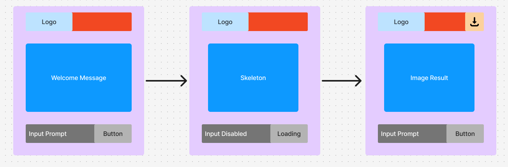
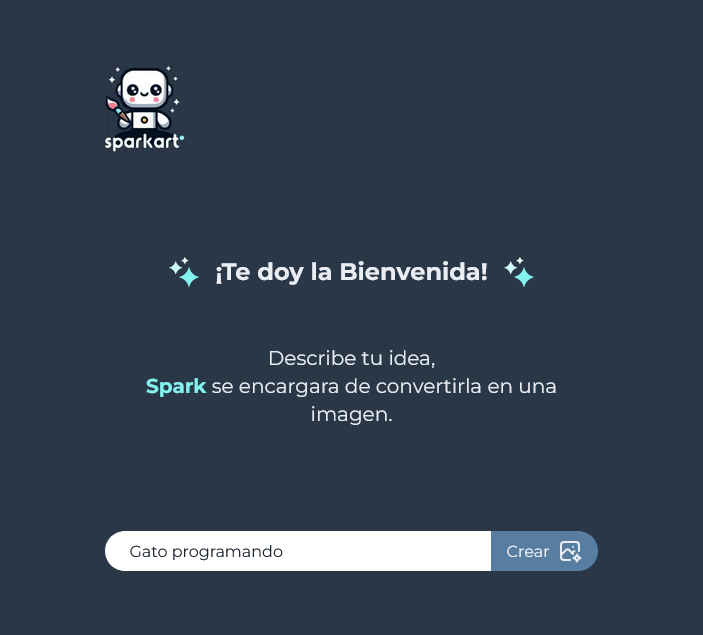
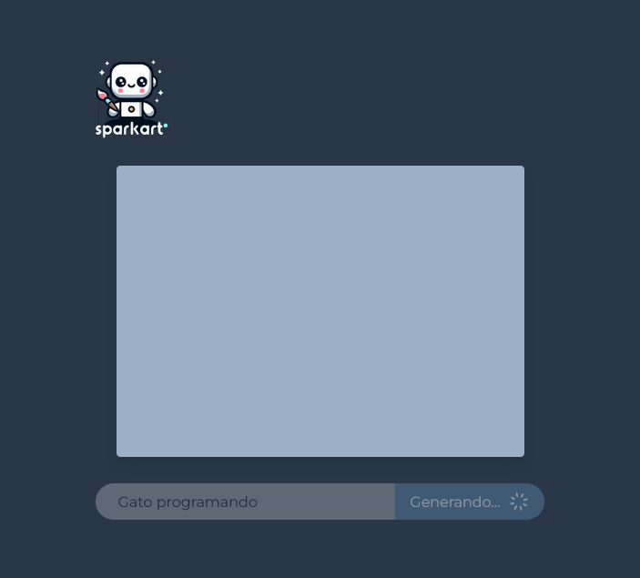
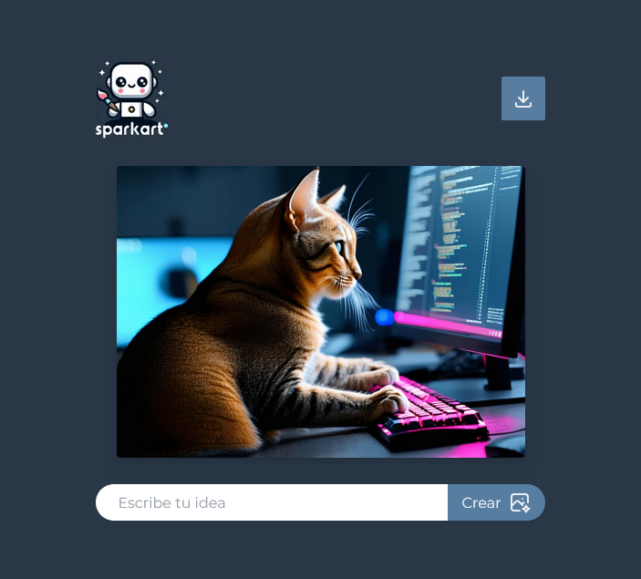

## Tabla de contenidos

- [SparkArt](#sparkart)
  - [Descripción](#descripción-del-proyecto)
  - [Tecnologías Utilizadas](#tecnologías-utilizadas)
  - [Estructura del Proyecto](#estructura-del-proyecto)
  - [Funcionamiento y Flujo de la Aplicación](#funcionamiento-y-flujo-de-la-aplicación)
    - [Introducción de una Idea](#introducción-de-una-idea)
    - [Generación de Imagen](#generación-de-imagen)
    - [Almacenamiento en Cloudinary](#almacenamiento-en-cloudinary)
    - [Visualización y Descarga](#visualización-y-descarga)
  - [Autor](#autor)

# SparkArt

SparkArt es una aplicación web que convierte ideas en imágenes generadas mediante inteligencia artificial. Desarrollada para permitir a los usuarios expresar su creatividad, SparkArt permite que cada idea se transforme en una representación visual única.

---

## Descripción del Proyecto

SparkArt es una aplicación de generación de imágenes donde los usuarios simplemente describen su idea en texto y, mediante el uso de inteligencia artificial, reciben una imagen que representa esa idea. Este proceso es posible gracias a modelos avanzados de IA, alojados en Hugging Face y la integración con Cloudinary para almacenar y gestionar las imágenes generadas.

---

## Proceso de Desarrollo

Para organizar y visualizar el flujo de la aplicación, cree un Sketch inicial utilizando **FigJam Board** de Figma. Esto facilitó tanto la creación del diseño como la planificación de la interfaz de usuario y el flujo general de la aplicación.

---

## Tecnologías Utilizadas

- **Next.js**: Framework de React para el desarrollo web moderno, facilitando la creación de aplicaciones de alto rendimiento.
- **React y React Hooks**: Facilitan la gestión del estado y los efectos secundarios de la aplicación.
- **TypeScript**: Se utiliza para garantizar un código más limpio y reducir los errores de tipo en tiempo de desarrollo.
- **Node.js** y **npm**: Herramientas esenciales para la creación de la aplicación Next.js y la gestión de dependencias.
- **Tailwind CSS**: Para un diseño CSS rápido, personalizado y responsivo.
- **Hugging Face Inference API**: Proporciona el modelo de IA para la generación de imágenes, específico para la transformación de texto a imagen.
- **Figma**: Para organizar y visualizar el flujo de la aplicación, cree un Sketch inicial utilizando **FigJam Board** de Figma.
- **Cloudinary**: Gestiona el almacenamiento y la entrega de las imágenes generadas.
- **Tabler Icons**: Biblioteca SVG utilizada para la iconografía de la aplicación.

---

## Estructura del Proyecto

La aplicación se estructura en base a los siguientes archivos y carpetas:

- **`app/page.tsx`**: Página principal, donde se maneja la interfaz y la interacción de usuario.
- **`app/layout.tsx`**: Diseño general de la aplicación, con una configuración de estilo unificada.
- **`app/components`**: Componentes reutilizables que mejoran la estructura de la interfaz.
- **`app/lib/types.ts`**: Definición de tipados TypeScript que aseguran consistencia en la aplicación.
- **`app/logic`**: Carpeta que centraliza la lógica de la aplicación.
- **`app/hooks`**: Custom hooks que encapsulan lógica reutilizable en la app.
- **`/pages/api/generate-image.ts`**: API interna que conecta con el servicio de Hugging Face para generar la imagen y luego la guarda en Cloudinary.
- **`public`**: Carpeta de archivos públicos, donde se incluye el logo de la aplicación y otros recursos estáticos.
- **`app/global.css`**: Estilos globales de la aplicación.
- **`app/favicon.ico`**: Ícono de la aplicación para favicon.

---

## Funcionamiento y Flujo de la Aplicación

### Introducción de una Idea

El usuario ingresa una idea en la barra de texto y presiona el botón "Generar".

### Generación de Imagen

La API procesa el texto en Hugging Face, donde la idea se transforma en una imagen.

### Almacenamiento en Cloudinary

La imagen generada se almacena en Cloudinary y se obtiene una URL pública para la descarga.

### Visualización y Descarga

La imagen se muestra en la aplicación, y el usuario tiene la opción de descargarla directamente.

---

## Autor

- Sitio diseñado y desarrollado por [Gabriel Oporto](https://gabrieloporto.vercel.app).
